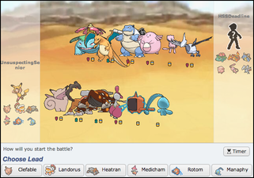
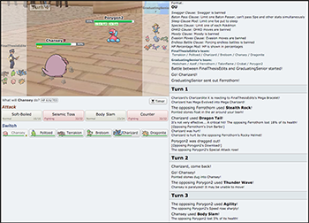

      
<!--
This is for including Chapter 1.  Notice that it's also good practice to name your chunk.  This will help you debug potential issues as you knit.  The chunk above is called intro and the one below is called chapter1.  Feel free to change the name of the Rmd file as you wish, but don't forget to change it here from chap1.Rmd.
-->

<!--
The {#rmd-basics} text after the chapter declaration will allow us to link throughout the document back to the beginning of Chapter 1.  These labels will automatically be generated (if not specified) by changing the spaces to hyphens and capital letters to lowercase.  Look for the reference to this label at the beginning of Chapter 2.
--> 
# Pokémon Showdown and The Pokémon World
## Introduction
  The world of Pokémon began in 1996 with the pair of games Pokémon Red and Green. For Western audiences, the latter game would become known as Pokémon Blue. These two games introduced a unique system turn-based game that continues to define the franchise of Pokémon games. Numerous other games have attempted to copy the Pokémon battling format, but none have been able to equal its widespread appeal and dedicated player base. With each successive iteration, new items, Pokémon types, and of course new species of Pokémon are added to the Pokémon lexicon. As a result, the world of Pokémon has continued to grow and evolve into one of the largest video games franchises to date. The most recent iteration of Pokémon games, Pokémon Sun and Moon, have continued Pokémon's commercial and historical trend of turning profits while adding layers to an already complex system of battling. 

  Since 2011 the program Pokémon Showdown has offered a simplified version of Pokémon games. This simplified version allows players to exclusively battle one another, replicating the most recent iteration of the Pokémon games in the process. This has allowed players to hone and test their Pokémon battling skills through the years. With well-over 10,000 daily registered users and counting, this program has become the go-to program to test and practice Pokémon battling strategies in the ultimate pursuit of becoming the very best that no one ever was.

However, before any formal analysis of Pokémon battling is discussed, the battling system of Pokémon must be rigorously detailed for laymen and theorists alike. 

First and foremost, each Pokémon battle occurs exclusively between two players. Each of the two players has a team composed of six Pokémon. For the purposes of analysis, teams with duplicate Pokémon will not be considered, namely because such teams are not allowed in ranked battles (and not included in the data considered in this study). As such, teams are composed of six distinct Pokémon. As a point of note, only battles in the 'Anything Goes' category allow any Pokémon to be used, including duplicate species within a player's team. Furthermore, depending on the battle format the team of six Pokémon is either randomly assigned or dictated by the player. The format being considered in this study, Overused (abbreviated OU), provides an example format where players dictate their team composition. A number of different battle formats exist beyond OU and Anything Goes, including Random Battles (abbreviated Randbats), giving a cumulative total of 59 different battle formats at the time this study was conducted. 

 

Regardless of the battle format, each turn each player simultaneously makes a decision for the Pokémon they have on the field. The decisions are then executed. The order of play is decided by a comparison of the moves each player selects. Priority is given first to priority moves and then, if neither player selected a priority move for the turn, by a comparative assessment of the speeds of the two Pokémon. If each player uses a move with the same priority, then the comparative assessment of speed is used to determine who attacks first. 

The potential moves Pokémon are able to execute have a wide variety of effects (the finer details are discussed in Chapter 2). Regardless of the damage or effects of the executed moves, once a player's Pokémon loses all of its health, an event referred to as fainting, the player must switch into another Pokémon. If a player has no other Pokémon to switch into, the battle ends. As would be expected, the player whose Pokémon have all fainted loses the battle. Conversely, the player who eliminates all of their opponent's Pokémon wins.  

Furthermore, each Pokémon has at most four possible moves to chose from during any turn of a battle. Whenever a player has at least two Pokémon that have not fainted, they have additional choice to switch into another Pokémon. Doing so counts as the player's action for the turn. As a result, players almost always have five different choices to make each turn. 

There are still a number of other details that are relevant to consider beyond those already mentioned. Namely, while some information is fixed during the battle, including the opposing players team composition, some variables of interest are case-specific. These include what moves an opposing Pokémon has already used, and consequently revealed, along with a given Pokémon's held item, its ability, and a slew of other variables. However, similar to the different type of moves a Pokémon can choose from, these points will be detailed in the Chapter 2. 

That being said, to formally analyze Pokémon battling the game itself must be formally denoted in game theoretic terms. This will aid in both describing the game and in highlighting its complexity. With this in mind, it bears noting that there are only two outcomes to any battle: One player wins and the other loses. Because of this, Pokémon battling is by definition a zero-sum game. However, it is important to note that there some distinctions between how a player can win or lose a game. Though the game ends when all of the Pokémon on one team have fainted, any player has the choice to forfeit the game any time before this occurs. Thus, the two ways to win or lose a battle are either by forfeiture or by having all of their Pokémon faint; this latter outcome is referred to as a full game. Additionally, there is the potential for a game to result in a draw. However, draws result in a neutral payoff as neither player raises or lowers their ranking after a draw. By contrast, when a player wins a battle their rank increases, while conversely if they lose their rank decreases. 

## Game Theory of Pokémon 
Within the scope of game theoretic terms, it is vital to note that each player is able to see all past decisions made over the course of a battle. Additionally, battles only last a finite number of turns. Speaking to the former point, players are able to recall not only their past decisions but also those of their opponent, including how much damage was done by a specific move during a given turn. In the format analyzed in this study, players even know the composition of their opponent's team from the very beginning of the match, as shown in Figure 1.1. More generally however, this information is available at any time during the battle, making Pokémon battling a perfect recall game. Furthermore, as each game is composed of a sequence of turns, Pokémon battling is a sequential game.

The points pertaining to the availability information allude to a unique trait of Pokémon battling that further details the type of game Pokémon battling is: An incomplete information game. Though the extent of incompleteness is format specific, each player is given limited information about the opposing player's team at the beginning of the battle. After each turn, players learn not only the different moves each opposing Pokémon has, but also their abilities, held items, and sometimes what other Pokémon compose the opposing team (if the format is Randbats). Generally speaking, there is almost always new information revealed each turn. 

Taken together, Pokémon battling is a special case of a sequential, zero-sum two-player game with incomplete information and perfect recall. As Pokémon battling lends itself to a discussion of imperfect information, it is all the more vital to consider the role of decision making within the context of sequential games. However, it is vital to note that this study will not do so using expansive game trees or comparison of payoff tables. Namely this is done due to computational limitations, which were ever present throughout the research process. 

However, the extent to which player strategies are revealed from information is an open topic of discussion, both in the post-estimation analysis if this study and current game theory literature. Naturally, the analysis of such a topic relies upon at least one a priori assumption, namely that player strategies are revealed by their past decisions. However, whether player strategies are rational and consistent is another matter entirely, and one that is not explicitly addressed. Nonetheless, it is important to note that incorporating such information into players own decision-making complicates analysis and is a central topic in analyzing player strategies specific to Pokémon battling. 

Game theoretic considerations aside, there are also important computational notes to detail. In this regard, initial computations and analysis focused on the distribution of turn lengths, i.e. the length of games played when one player forfeited or had all of their Pokémon faint and the corresponding distribution of game lengths. These initial computations revealed that there were a number of battles that lasted less than one turn, which were then pruned from later models and analysis. Following this, moves are categorized by their type, specifically whether a specific move is a "setup" move or may be considered complementary to a "setup" move. These two types of moves are considered in greater detail in Chapter 2. Following this, I gauge the effectiveness of using specific moves on the empirical probability that using such move corresponded to a winning outcome. 
  
Overall I explore the decision-making process involved in Pokémon battling, specifically moves that are considered patient and moves considered complementary to patient moves. By incorporating tenants of behavioral economics and game theory, I hope to highlight not only the empirical probabilities of winning associated with specific move sets, but also analyze how and why such events may contribute to a higher lilkihood of winning a battle. More specifically, I will continue the recent trend of 'Big Data' analysis to explore macro trends in player's decision making processes. In doing so I hope to answer two main questions: Does utilizing patient strategies positively influence the likelihood of winning a Pokémon battle, and are these findings generalizable across specifications? In the context of Pokémon battling, is a player is better off by deciding to use one type of entry hazard over another and are these findings generalizable across when in the battle the moves were used?   

## Literature Review
Scant rigorous or academic research has been conducted within the scope of Pokémon-related topics. The most frequent publications have typically focused on Pokémon as a cultural phenomena or have been official strategy guides for the various Pokémon games published by Nintendo affiliates. Importantly, these strategy guides do not detail Pokémon battling strategies, although they do detail the numerous Pokémon species, items, and moves available in each game. Thus, strategy guides provide a foundational background about the Pokémon, moves, and other basic information but do not provide clear formulations of general battling strategies. Some recently publications have come close though. 

Academic papers that have focused Pokémon battling have developed and analyzed algorithms to simulate Pokémon battling and play against human players in the program Pokémon Showdown. The first paper of this kind gives a rudimentary background on Pokémon battling and focuses explicitly on 1v1 battle simulations (Gildardo 2013). However, in a detailed analysis of one particular one-on-one scenario the author is single minded and only focuses on one-on-one Pokémon battles. Furthermore, Gildardo (2013) does not consider other potential variants on Pokémon abilities or item pairings. In this regard, Gildardo's article does not go into great detail on the many variants of Pokémon battling, as highlighted by the exclusion of teams of Pokémon. 

This point notwithstanding, since Gildardo (2013) there has been one other notable publication that focuses on Pokémon battling. This publication focuses on the creation and analysis of algorithms within the context of Pokémon battling; the article additionally goes into greater detail on battling strategies while incorporating comparative analysis of the different algorithms used to play against human opponents (Ho et al. 2016). Though Ho et al. 2016 focused on what is currently a previous iteration of Pokémon Showdown, the iteration of Pokémon Showdown is fundamentally the same as that of the data used in this study. Nonetheless, the paper does have some shortcomings as well. Namely, the algorithms used would never select a move whose type would be not very effective against the opponent's fielded Pokémon. This point will be detailed later, but needless to say such a decision is not always the preferred one, especially if the moves being used are entry hazards.  

Furthermore, on the subject of different versions of Pokémon Showdown, relevant documentation of the past iterations of Pokémon Showdown are available at the program's website. The website for Pokémon Showdown provides a hub for information ranging from Pokémon battling basics to specific battle format descriptions. Similar to all information mentioned thus far, replays and ladder ranking are available publically. Furthermore, the site provides Pokémon usage statistics and a damage calculator for aspiring Pokémon battlers. 

  As noted previously, game theory vernacular has not entered into discussions on Pokémon battling strategies, at least in any formal setting. Applying such concepts to the context of Pokémon battling offers a formal foundation to discuss strategies and test hypotheses. In this regard, there are three main areas of game theory that intersect in the analysis of Pokémon battling. These three areas of interest include the interpretation of Pokémon battling as a zero sum game, the role of incomplete information, and the implications of Pokémon battling as a non-cooperative game. These three topics actively influence the decision-making process associated with Pokémon battling. 
  
 A central factor involved in the decision making process as it relates to game theory is the role of information, specifically how players incorporate information revealed each turn into their strategies. As information is revealed each turn, including the four moves an opposing Pokémon has, each Pokémon's ability, held item, and a number of other factors, it is vital for players to determine if the information they just received in a given turn is relevant. Simply put, players need to decide if the information they just received provides any insight into their opponent's strategy. Overall, this speaks to Pokémon being a game with imperfect information. As such, it is not possible to apply Zermelo's theorem, though its negation provides insight as to the possible existence of a weakly dominating strategy (Schwalbe et al. 2001). The method to empirically test such strategies is by tracking the use of specific moves, in this study entry hazards and complementary moves, and testing whether players that used specified move sets won more games than players that did not utilize such move sets. 
 
This being said, concepts from game theory are not the only relevant ideas for analyzing Pokémon battling. In the context of exploring the frequency of players switching Pokémon will necessarily invoke concepts from behavioral economics as well as game theory. Relevant to the field of behavioral economics, the concept of "keeping doors open" is an interesting concept to explore in regards to Pokémon battling. The concept of "keeping doors" open is explored in Chapter 6 of Ariely's work Predictably Irrational, giving an idea of what the expected results may be in the context of Pokémon battling. Specifically, as players may decide to preemptively switch Pokémon in the hopes of having that Pokémon later in the battle, they may arrive at suboptimal outcomes. Via application of Ariely's empirical results, players may prefer to keep certain Pokémon available until the end of the battle, even if doing so incurs costs and/or reduces their chances of winning. Though this concept is not explicitly tested, this study tackles a similar though contrapositive point by empirically testing whether moves that do not necessarily incur damage the turn they are used result in a higher likelihood of winning a battle. By doing so, this study tests whether players are better off when they only use damaging moves, or specifically non-entry hazard moves. However, before tackling how to formulate a testable hypothesis, some of the finer details of Pokémon battling must be highlighted.  

<!-- An especially interesting addition to the analysis of incomplete information in Pokémon battling is the topic and implications of asymmetrical information. In this regard, the concepts of sunk costs and signaling may enter into the equation. Especially for the Randbats format, each player is given minimal information at the onset of the game. And while each turn, players both gain information, they may receive new information at different rates. The implications of this point may provide insight into specific strategies, and is a point of future analysis. -->
  
<!-- As an ending point of interest, taking into account opposing players' strategies as deduced from revealed information rubs against issues related level-K thinking. To elaborate further, knowing that a player is likely to repeat the same decision made the previous turn, players may be able optimize their decision by presuposing what decision their opponent is going to make. However, if the opposing player decides to incorporate that very assumption into their own decision, they may arrive at a vastly different outcome than would be expected. Furthermore this outcome may even be suboptimal for both players. That being said, the inclusion of level-k thinking is closely aligned to recent behavioral game theory literature. A central finding of this literature has emphasized the role of iterated reasoning, which essentializes player adaptation to other players' decision making (Wunder et al. 2011). Notably this will be a point to consider and incorporate into the analysis of Pokémon battling in a game theoretic framework. --> 