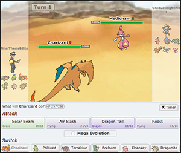

# Game Description 
The data used is a compilation of battle logs taken from the Pokémon Showdown servers. The data spans the entirety of December 25th, 2015 to December 27th of the same year. No battle logs are incomplete, i.e. none of the daily data entries are empty, though some are excluded for their turn length. Each battle effectively serves as two observations in the dataset, one observation for each player. Overall, there were no dramatic overhauls done to the OU format or the overall Pokémon battling system used in this study. However, some adjustments have been made since the time covered in this study and will be highlighted in the analysis portion of the study. 

Furthermore, only ranked games are included in the dataset. Ranked battles are battles that count towards a players global ranking in Pokémon Showdown. For each battle, players stand to gain or lose ranking points depending on whether they win or lose the battle. 

As noted in the Literature Review, a number of different Pokémon databases redirect users to the host site of Pokémon Showdown. The name is this site is Smogon University. The website for Smogon University offers a wide variety of resources, similar to those found at the Pokémon Showdown website. Most importantly the Smogon forums are a prominent site for discussion of Pokémon battling strategies, along with detailing what Pokémon compose specific battle formats. 

## Pokémon Battling Basics
The Pokémon battle starts with one Pokémon being sent out from each player's team. For the purposes of the data used in this study, one Pokémon is sent out from each opponent. This totals two Pokémon being active at any given point in the battle. Following this, each Pokémon has 4 moves to choose from, along with the option to switch to a different Pokémon (when applicable). After both players make a decision, the moves are weighted for priority and speed to determine the order of play. If both players decide not to switch, one Pokémon will attack the other, after which the next Pokémon will do the same if it has not fainted. After each move has been executed the turn ends and the process is repeated. When one of the Pokémon faints, the player whose Pokémon fainted will be prompted to select another Pokémon from the bench. The first player to lose all of their Pokémon loses the battle. 

However, before the nitty gritty details are explained it is important to make a concession. The entirety of the Pokémon battling system, even that used in the data, is not included in this analysis. The number of cases that deviate from the rules detailed below are either not included in the competitive format, or are generally inconsequential to the scenarios and strategies considered in this study. 

### Battle Formats 
The data used for this study includes only one battling format: OU. The two most frequently used formats are OU and Randbats respectively, at least as indicated from preliminary fact-finding. Both formats have teams of six Pokémon and only allow one Pokémon to be out at any given time. While both battle formats are subsets of what are known as single battles, only OU will be highlighted in greater detail. 

The OU format includes team composition. By including team composition, players are able to decide what Pokémon to include on their team, the moves of each Pokémon, and other parameters such as held items and abilities. However, there are still some restrictions placed on players. Specific species of Pokémon are barred from use, notably Pokémon classified as "Ubers". Uber Pokémon include a large number of legendary Pokémon, along with some mega-Pokémon. Additionally, certain "hidden" abilities are restricted, limiting the possible Pokémon abilities a specific species may use for a given format. 

#### Format-Specific Pokémon
There are a number of other battle formats that are not analyzed in the current study. Nonetheless, a brief overview of these is germane in relation to the different Pokémon explicitly studied. The order of 'tiers' is as follows: Uber, OU, BL, UU, NU, and Limbo, where BL stands for Borderline, UU stands for Under Used, and NU stands for Never Used. A number of species in tiers below OU are used in the battles observed in the dataset. Just as Ubers allows use of Pokémon that are from OU battles, so too do the other tiers of Pokémon battling, i.e. UU allows use of NU Pokémon. However, there are a number of Pokémon that 'belong' to a given tier, insomuch as they are considered staple Pokémon of that format. To reduce the list of 600+ Pokémon, the roster of Pokémon considered in this study are the 415 Pokémon that are considered staple Pokémon for the tiers spanning OU to Limbo. This effectively reduces the number of Pokémon that are considered competitive, along with doing so in a manner that is systematic to the players of the games considered. That being said, it's important to delve into some Pokémon-specific topics that are general to the battling system, not necessarily related to specific battle formats. 

### Pokémon Types 
Typeage is a unique characteristic to Pokémon battling. Currently there are 18 distinct types. These include normal, fire, water, electric, grass, ice, fighting, poison, ground, flying, psychic, bug, rock, ghost, dragon, dark, steel, and fairy. Both moves and Pokémon are given a type attribute, though moves are only one type. Additionally, while a move may only be one of the 18 types, a Pokémon can be at most two different types at once. 

However, some of these combinations are not found in Pokémon. From the initially possible 171 Pokémon type combinations, 18 choose 2 plus 18 monotypes, there are actually only 133 types that a player may encounter or chose from (as 38 type combinations had not yet been used during 2015). It is also worth noting that some Pokémon are able to change type during a battle, but for the purposes of analysis these Pokémon will be considered special cases and will be briefly touched upon in Chapters 3 and 4.  

The typeage of each Pokémon influence not only the potential weaknesses of each Pokémon, but also the amount of damage that type-specific does. Each Pokémon has at least one and at most two types. If a Pokémon uses a damaging move whose type corresponds to the typeage of the Pokémon that used it, that Pokémon gets a same type attack bonus, abbreviated as a "stab" bonus. This causes the move to do 50% more damage, potentially 100% if the Pokémon also has the ability Adaptability. 

### Pokémon Attributes 
Generally, there are a number of factors that are specific to each Pokémon. Some of these factors are considered static, meaning that they do not and cannot change over the course of the battle. These types of factors are defined as "Fixed" attributes. However, some factors such as the base statistics of a Pokémon are fixed at the beginning of the battle and *can* change over the course of a battle. There are also a number of factors that are able to generally change over the course of a battle. Such factors, by constrast, are defined as "Variable" attributes. The terminology is largely taken from Ho et al. (2016) for ease of appropriability. The attributes are detailed in the order given. 

### Pokémon Fixed Attributes
Fixed attributes include the typeage of a Pokémon, the four moves each Pokémon specie has, the item the Pokémon holds, the Pokémon's ability, the level of the Pokémon, and the Pokémon's base statistics. However, there are exceptions to the rules for each of these attributes except for the level of the Pokémon. Every fixed attribute and its respective exception(s) will be considered in the order listed. 

First and foremost is the typeage of a Pokémon, detailed previously. One scenario where a Pokémon can change its type is specific to a Pokémon's ability. Both Protean and Color Change are abilities that are able to change a friendly Pokémon's typeage. The former ability changes the Pokémon Kecleon's type to that of the move that affected (or hit) it, whereas the latter ability turns its type into the typeage of the move that just was just used by the Pokémon Greninja. These two abilities are specific to Kecleon and Greninja. Furthermore, there are moves that able to make the opponents Pokémon into a water, grass, or ghost Pokémon (on top of their previous typeage) if they use the moves Soak, Forest's Curse, and Treat-Or-Treat respectively. 

Each Pokémon's set moves are also fixed during a battle. The exception to this occurs when a Pokémon runs out of power points, denoted as PP, for all of its four moves. Every move has a set limit to the number of times it can be used, though the number of times a move can be used varies across the set of moves. At this point the Pokémon is only able to use the move struggle. The move is a physical attack that will also the damage the user of the move. The struggle is real.  

Pokémon are able to hold one item at the beginning of the match. Pokémon may also lose their held item either by being hit by the move Knock-off, which knocks the opponent's Pokémon's item off, or by using their held item. Some held items are able to be consumed for a one-time effect. This scenario includes the consumption of berries, which offer a variety of different effects to the Pokémon holding it. For example, if a Pokémon is given a status condition, a condition detailed in the following section, from an opposing Pokémon while holding a Lum berry, the berry will be consumed and the Pokémon's status condition will be cured. The player does not actually control when the berry will be consumed, as the consumption of the berry is dependent upon what moves an opponent uses on said Pokémon. This example highlights an important characteristic of some held-items: some items may only be used once and are discarded after their initial use.  

One of the most important items that a Pokémon can hold is an item that allows the Pokémon to mega-evolve. When a Pokémon mega-evolves, it increases its base statistics, changing its ability, and even changing the typeage of the Pokémon. This special case of item holding is a focus of this study. Additionally, only one mega-Pokémon is allowed on a team at once, making variables that account for the different mega-Pokémon independent by nature. An example of a Pokémon that has undergone mega-evolution is shown in Figure 2.1. 

 

Similar to items, a Pokémon can only have one ability at a time. However, by contrast to a Pokémon's held item a Pokémon always has an ability. A Pokémon cannot have no ability. Nonetheless, Pokémon may have their ability swapped with another Pokémon's. This scenario only occurs a Pokémon makes physical contact with Yamask or Cofagrigus, at which point its ability is swapped with Mummy. Mummy will only change a physically-attacking Pokémon's ability; it has no other effect. 

The level of a Pokémon varies between one and one-hundred. The higher the level, the better the base statistics for a given Pokémon, specifically in comparison to lower levels of that given Pokémon. Base statistics are divided into six categories. These categories include (baseline) health, attack, special attack, defense, special defense, and speed. There is further nuance with the inclusion of Pokémon natures and Individual Values, or IVs. These factors influence the base statistics of each Pokémon. However due to the sheer number of trivial combinations of IV spreads and nature choices, these two factors will not be a pivotal aspect to the framework and analysis of Pokémon battling. Nonetheless, the volatility of these baseline stats will be considered as a variable attribute. 

### Pokémon Variable Attributes
Variable Attributes include boosts or reductions to a Pokémon's base statistics, the status condition of the Pokémon, the volatile status of the Pokémon, the current health of the Pokémon, and whether the Pokémon is currently active. 

The former-most attribute directly influences how effective an active Pokémon is able to be in battle. Pokémon are able to learn and use moves that can boost their own status or ones that reduce their opponents. However, these moves are only able to influence a Pokémon's attack, special attack, defense, special defense, or speed. For example, the move Swords Dance raises its users attack status so long as the Pokémon remains active. The move may be used multiple times, but is only effective until it boosts or lowers its target's baseline stat by 3 or 1/3 respectively. 

Status conditions are composed of a variety of statuses. Pokémon that suffer a status condition are either burned, frozen, paralyzed, poisoned, badly poisoned, or have fallen asleep. A Pokémon can only suffer from one status condition at a time, although a Pokémon can suffer from multiple status conditions during a battle if it overcomes the first status condition. 

Each of these statuses is distinct, though there are similarities between being poisoned or badly poisoned. A Pokémon that is just poisoned will take damage equal to 1/8th of its maximum HP at the end of each turn. By comparison a Pokémon that is badly poisoned takes n/16th of its maximum HP at the end of the nth turn the Pokémon has been badly poisoned. A Pokémon that is poison-type or steel-type is unable to be poisoned, and if a Pokémon has the ability Poison Heal it is healed 1/8th of its maximum HP at the end of each turn. 

If a Pokémon is burned it takes 1/8th of its maximum HP in damage at the end of the turn. This has recently been changed to 1/16th of its maximum HP per turn, but this is just a passing point of note. Regardless of the amount of damage done to the burned Pokémon, the burned Pokémon's physical attacks do half damage. The exception to this rule is if the affected Pokémon has the ability Guts. Additionally, a fire-type Pokémon cannot be burned. 

In a similar vein to being burned, a paralyzed Pokémon has its speed reduced to 1/4th of its base speed. Furthermore, a Pokémon that is paralyzed has a 1/4 chance of not being able to move during its move. This event is referred to as being "fully paralyzed". Furthermore, electric-type Pokémon are unable to be paralyzed, and if a Pokémon has the ability Lightning Rod it's special attack is boosted by 1.5 its base level. Additionally, ground-type Pokémon cannot be paralyzed, just as they are not affected by electric-type moves. 

A Pokémon that has fallen asleep is unable to use its moves except for the moves Snore and Sleep Talk. A Pokémon falls asleep for one to five turns. However, if a Pokémon purposely puts itself to sleep using the move rest, it is asleep for exactly two turns. If a Pokémon has either of the abilities Vital Spirit or Insomnia, it cannot be put to sleep. 

Lastly, there is the status condition of being frozen. Similar to previous typed statuses, ice type Pokémon are immune to becoming frozen, as are Pokémon with the ability Magma Armor. There is no set number of turns that a Pokémon can be frozen, but if a frozen Pokémon is hit by fire-type moves or the move scald is thaws out and is no longer frozen. 

Volatile statuses are similar to status conditions, except that the volatile status will be negated by switching out the affected Pokémon. Similar to status conditions, a Pokémon can only be affected by one volatile status at a time. Another important point to consider is that a Pokémon can suffer from both a volatile status *and* a status condition, i.e. a Pokémon can be both paralyzed and confused. That being said, the most common form of volatile status is confusion. A Pokémon is confused for one to four turns, during which time the confused Pokémon has a 50% chance to hurt itself instead of executing its move for the turn. A Pokémon may also be encored, meaning that it has to use the same move it just moved for 3 turns. 

Only currently active Pokémon are able to execute moves. Likewise, only active Pokémon may be damaged. Beyond this there is not anything else to detail in regards to the current health and activity of a Pokémon that is exclusive to variable attributes. 

### Environmental Variables ("Patient Moves")
There is one more class category to detail that is relevant to the analysis of Pokémon battling. This category is the role of the environment in battling and is a central focus of this study's analysis of Pokémon battling. Though related to the different types of moves and abilities a Pokémon has, including both fixed and variable attributes, the environment is not specific to any one move, ability, or specie of Pokémon and as such must be highlighted separately from the previous attributions. 

The most prominent environmental variables to consider are what are referred to as "set-up" moves. These moves include Stealth Rock, Spikes, Toxic Spikes, Sticky Web, Light Screen, and Reflect. The latter two are different from the rest of the set-up moves in that they only last five turns, eight if the user was holding Light Clay when the move was used. When these moves are employed, the active Pokémon's special defense and defense are raised by one stage -or is increased by 1.5- respectively between Light Screen and Reflect. However, Light Screen and Reflect are not considered in the model specifications because they have a limited effect. 

The former four set-up moves are a focal point of analysis and are in a category of moves known as entry hazard moves. Entry hazards are considered patient moves in this study due to their indirect effects, namely that they do not directly damage opposing Pokémon the turn they are used. These moves are of particular note because they can last for the entirety of a given battle. Once these moves are used, only certain moves or switches are able to eliminate them. Generally, using the move rapid spin or defog will eliminate the entry hazards, along with causing other effects. However, if a Pokémon uses defog, both their and their opponent's entry hazards will be eliminated. By contrast, rapid spin only eliminates entry hazards affecting the users team. 

However, both defog and rapid spin are not included in the analysis. Instead, moves that are seen as supplemental to entry hazards are considered. The four moves that are considered supplemental to entry hazards include Dragon Tail, Circle Throw, Whirlwind, and Roar. The latter two moves only switch out the opposing player's Pokémon, whereas the former two moves will damage the opponent's active Pokémon and then switch them out. All of these moves force the opponent's active Pokémon to switch into another random Pokémon on their team. This process necessarily requires the opponent to have another Pokémon to switch into. However, as players always know how many more Pokémon are available for both their and their opponent's teams, an underlying assumption is that these moves are not used trivially, i.e. when the opposing player only has one Pokémon left on their team. 

Moreover, there is still the matter of detailing entry hazards. To begin with, both Stealth Rock and Sticky Web can only be used once during a battle, at least until previous uses of either are eliminated by use of moves such as Rapid Spin. However, each of these entry hazards have different effects. Specific to the latter, Pokémon that enter the field after Sticky Web is employed have their speed lowered by one stage, or 2/3rd their baseline level. This only applied to grounded, or non-flying, Pokémon however. By contrast, Stealth Rock will damage any Pokémon that enters the field after it is used. The amount of damage done to the Pokémon depends on the type effectiveness of rock-type moves, as Stealth Rock is a rock-type move. In ascending order, Stealth Rock will do 3.125%, 6.25%, 12.5%, 25%, and 50% of the affected Pokémon's maximum health according to type effectiveness. This corresponds to 0.25x, 0.5x, 1x, 2x, and 4x damage respectively. 

Similar to Sticky Web, spikes only affect non-flying type Pokémon. However, spikes will inflict damage to Pokémon that switch in instead of afflicting them with a volatile status condition. The amount of damage is dependent upon the number of layers of spikes active on the field. Spikes may be applied a maximum of three times. One layer of spikes will damage the opposing Pokémon by 1/8th of its maximum HP, while two layers will deal 1/6th, and three layers will do 1/4th of the opposing Pokémon's maximum health. 

Lastly is toxic spikes that, just like spikes and sticky web, only affect grounded Pokémon with a status condition. However, toxic spikes are able to be applied two times. The first layer of toxic spikes will poison opposing Pokémon that switch in, while two layers of toxic spikes will badly poison Pokémon that switch in (that is, if the Pokémon that switches in is able to be poisoned). Just like most other entry hazards, toxic spikes only affects grounded Pokémon. 