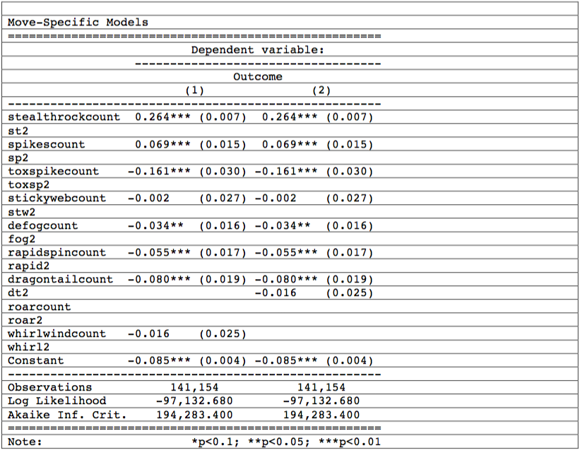

```{r include_packages_2, include = FALSE}
# This chunk ensures that the thesisdown package is
# installed and loaded. This thesisdown package includes
# the template files for the thesis and also two functions
# used for labeling and referencing
if(!require(devtools))
  install.packages("devtools", repos = "http://cran.rstudio.com")
if(!require(dplyr))
    install.packages("dplyr", repos = "http://cran.rstudio.com")
if(!require(ggplot2))
    install.packages("ggplot2", repos = "http://cran.rstudio.com")
if(!require(ggplot2))
    install.packages("bookdown", repos = "http://cran.rstudio.com")
if(!require(thesisdown)){
  library(devtools)
  devtools::install_github("ismayc/thesisdown")
  }
library(thesisdown)
load("data/d1.Rda")
```
# Data 

Due to the vast number of parameters included in the numerous models outlined previously, summary statistics and an output of five of the six models is contained in the Appendix section. Comments on each are provided with some brief context of their interpretation. 

Going in the order of the Appendices, the summary of the variables used in the analysis are a good starting point. The average game length is sixteen turns. However, the average is biased from games that lasted zero turns. As these games did not provide any meaningful information, they are excluded from all regressions used. Furthermore, in regards to ranking, most observations are within the range of 1000 to 1280 elo, as the mean rank is 1154 with a standard deviation of nearly 130 elo points. Given that the highest rank observed in the data is 1815, there is a noticeable divide between the highest ranking games and those within the range of standard deviations to the mean rank.  

Nonetheless, the real meat of the summary statistics is with the large range of different Pokémon species and Mega-Pokémon that players used. In this regard, nearly half of the most frequently used Pokémon, that of Alakazam, Banette, and Garchomp, have a Mega-evolution. Though specifically in regards to the Mega-evolution usage statistics, the four most frequently used Mega-Pokémon are Mega-Venusaur, Mega-Scizor, and both Mega-evolutions of Charizard, though Alakazam, Banette, and Garchomp are not the most infrequently used Mega-evolutions. 

It is important to bear in mind that Mega-Pokémon are not always utilized however, given by the fact that the cumulative sum of the mean of all Mega-Pokémon variables does not add up to one. Given this discrepancy, it would be fruitful to test whether utilizing a Mega-Pokémon marginally impacts whether a player wins a battle. Within this group of three Garchomp is the outlier, as both Mega-Alakazam and Mega-Banette were banned from the OU format following the year of the data used. Besides this standout feature of the summary statistics, the remaining frequently used Pokémon are considered staples of the OU format: Clefable, Talonflame, and Heatran. Of the total six most frequently used Pokémon, half have the ability to use the move Stealth Rock. This is important to bear in mind when considering the preliminary models. 

```{r, out.width = "400px", echo=FALSE}

```

Included above is the results of the first two model specifications. Sadly, the two models are alike in their log liklihood values and in their Akaike information criterion (AIC) values. Simply put, adding squared terms for the nine specified moves did not add anything meaningful to the initial model. This may be just a byproduct of the data however, as the only move variable with values greater than one was for the move Dragon Tail. Nonetheless, it is important to note that nearly all of the entry hazard moves are statistically significant. Though, this being said, only Stealth Rock and Spikes contribute positively to the marginal likliehood of winning a battle. This contributes to some semblence of generalizability though, as both Stealth Rock and Spikes are the only entry hazards that directly damage opposing Pokémon when they enter the battlefield. 

The statistical significance of the entry hazards is also verified in further model specifications. While the use of Toxic Spikes becomes less statistically significant with the inclusion of both single Pokémon choice and Mega-Pokémon choice, the sign of the variable remains negative. Furthermore, while later specifications continue to report Spikes as a statistically significant move choice, the magnitude of using the move appears to diminish when including other factors such as Pokémon choice. 

Overall, the use of Pokémon roster and Mega-Pokémon roster appear to be more meaningful variables than the use of simple move counts, as is evidence from comparison of log liklihood and AIC values. This improvement in model quality is also found in comparison to all previous models with the final model (6). While residual deviance is not reported for each model, the AIC lends credence to the comparative view of model (6) as the model of best fit for those specified. Though, this being said, the final model is particularly difficult to digest due to the number of parameters specified. 

The final model is adds meaningful insight to the simple move counting variables. Interacting the move count variable for Stealth Rock and all Pokémon that can potentially learn (and use) Stealth Rock, the model indicates that there is a nonuniform effect on win outcome depending on which Pokémon used it. This view may be appear counterintuitive, but it does offer a useful illustration to the complexity of Pokémon. Take for example two hypothetical instances where Stealth Rock is used by two different Pokémon on the same enemy Pokémon. While each may successfully execute the move on that turn, the opposing Pokémon gets to execute a move as well. If, in this instance, the move is the same, then damage is calculated according to the type matchup of the opposing move with the Pokémon; this may knock out one Pokémon while leave another with enough health to execute one more move. 
